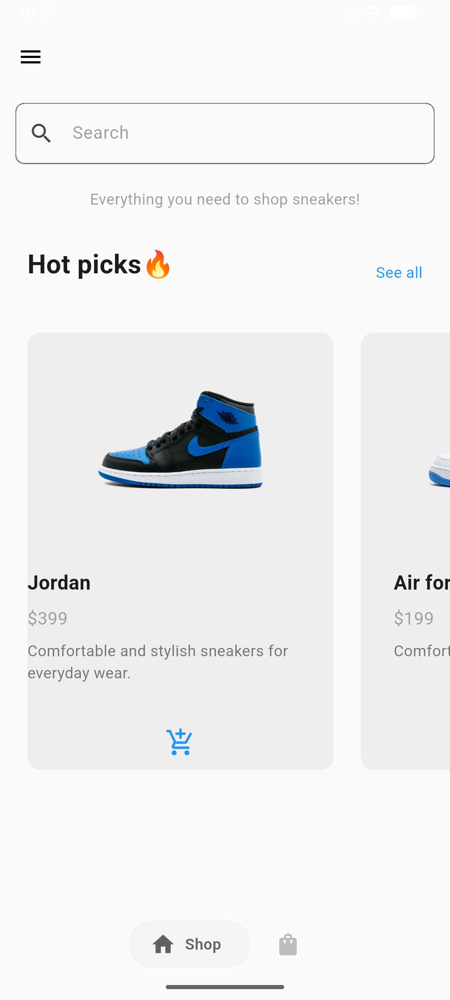

# 👟 Sneaker Shop App

A sleek and modern e-commerce mobile application inspired by **Nike** design. Built with Flutter, this app demonstrates clean UI, smooth navigation, and robust state management.

## ✨ Key Features
* **Minimalist UI**: Clean aesthetic with custom buttons, drawers, and bottom navigation bars.
* **Dynamic Shop**: Horizontal scrolling "Hot Picks" list for an interactive shopping experience.
* **Cart Functionality**: Real-time item management-add or remove sneakers with instant UI updates.
* **Provider State Management**: Efficient data flow across the app using the Provider package.

## 🛠 Tech Stack
* **Framework**: [Flutter](https://flutter.dev)
* **Language**: [Dart](https://dart.dev)
* **State Management**: [Provider](https://pub.dev/packages/provider)
* **Icons**: Lucide Icons & Material Design Icons

## 🚀 Getting Started

### Prerequisites
* Flutter SDK installed.
* Android Studio / VS Code.
* An Emulator or physical device.

### Installation
1. Clone the repository:
   ```bash
   git clone [https://github.com/your-username/sneaker_shop_app.git](https://github.com/your-username/sneaker_shop_app.git)
2. Navigate to the project folder:
   ```bash
   cd sneaker_shop_app
3. Get dependencies:
    ```bash
   flutter pub get
4. Run the app:
    ```bash
   flutter run

## 📸 Preview




## 😺Cute cat


)))
